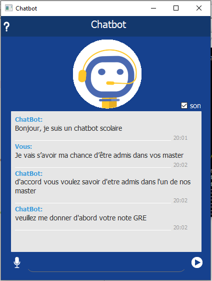
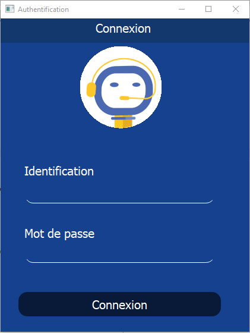
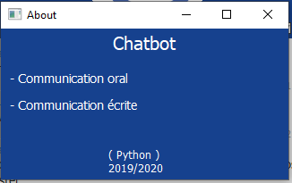

# Chatbot-with-Python-and-Deep-Learning
## Application

 ChatBot that will help students in university. In order to reduce the response time and better retain the students of our faculty, a chatBot should report responses in real time with availability 24/24 and 7/7 days. able to interact with students in different mannerisms, behaving like a human(speech to text and text to speech) agent who answer student questions. This ChatBot offers several features: 

<li> Internship agreement
<li> Modules notes
<li> Registration and required conditions
<li> The possibility of being admitted to the masters based on TCF scores, cover letter, letter of recommendation ...
<b>

###	Authentification

This is an essential phase in setting up an application. It consists of two simple input areas, one reserved for the user name, the other for the password on which the characters entered are hidden and a button that allows access to the main interface if the password and the login are correct, otherwise an error message will be displayed on a dialog box.

### About

This window show information about application

App video : <a href="https://www.linkedin.com/posts/mohamed-aghezzaf_smartchatbot-chatbot-python-activity-6709044049849937920-zRs1">Lien<a/>  
### Contact
Linkedin: <a href="https://www.linkedin.com/in/mohamed-aghezzaf/">aghezzafmohamed<a/>  
Gmail: aghe.mohamed@gmail.com
